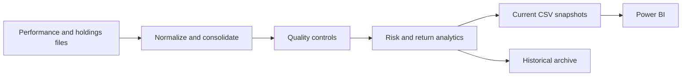

# Fund Reporting ETL and Analytics

<p align="center">
  <strong>Turn heterogeneous fund data into auditable, Power BI-ready reporting datasets.</strong><br>
  Extraction, normalization, risk/return analytics, historical backfills, and validation controls.
</p>

<p align="center">
  <a href="https://www.python.org/"></a>
  <a href="https://github.com/tiagoslantunes/Streamlining-Data-Reporting-Processes/actions/workflows/quality.yml"></a>
  
</p>

This project replaces manual consolidation of performance, volatility, exposure, and holdings files with a reproducible pipeline. It preserves missing-data evidence, enforces no look-ahead in historical metrics, and keeps immutable snapshots for auditability.

> Source files are not included because they may be licensed or confidential. The repository contains the generic processing and validation logic only.

## Capabilities

| Stage | What it does |
|---|---|
| Extract | Reads heterogeneous CSV/XLSX vendor layouts and flexible dates |
| Transform | Normalizes identifiers, exposures, holdings, returns, and volatility |
| Analyse | Calculates absolute, benchmark, and relative performance metrics |
| Validate | Detects header drift, identity changes, and snapshot differences |
| Persist | Writes current outputs and immutable historical archives |



## Project structure

| Path | Purpose |
|---|---|
| [`automation_pipeline.py`](automation_pipeline.py) | Main ETL orchestration and current-period metrics |
| [`performance_analytics.py`](performance_analytics.py) | Vectorized absolute, benchmark, and relative analytics |
| [`backfill_performance_metrics.py`](backfill_performance_metrics.py) | Historical no-look-ahead rebuild |
| [`corr_threshold_validation.py`](corr_threshold_validation.py) | Correlation-threshold statistical validation |
| [`validate_exposure_header_classification.py`](validate_exposure_header_classification.py) | Exposure taxonomy regression check |

## Expected data layout

```text
<root>/
├── 01_MorningStar/
│   ├── 01_Daily/
│   ├── 02_Monthly/
│   └── Output/
└── Reporting Docs/
    └── Benchmark_Mapping.xlsx
```

The benchmark workbook must contain `Benchmark` and `Output Metric` sheets. Vendor-specific subfolders and filenames are documented in the parser configuration inside `automation_pipeline.py`.

## Quick start

```bash
git clone https://github.com/tiagoslantunes/Streamlining-Data-Reporting-Processes.git
cd Streamlining-Data-Reporting-Processes
python -m venv .venv
python -m pip install -r requirements.txt

python automation_pipeline.py --root /path/to/reporting-root
```

Alternatively, configure the root once:

```bash
export FUND_REPORTING_ROOT=/path/to/reporting-root
python automation_pipeline.py
```

PowerShell: `$env:FUND_REPORTING_ROOT = "C:\path\to\reporting-root"`.

## Historical backfill

Run the backfill after the main pipeline has produced `Performance.csv`:

```bash
python backfill_performance_metrics.py --root /path/to/reporting-root
```

For each month-end, the calculation uses only observations available up to that date. Past years are moved to `Output/All Perf Metrics Hist/`.

## Metrics

- Absolute: cumulative return, annualized volatility, Sharpe ratio, drawdown, downside deviation, and positive-month count.
- Benchmark: the same metrics for up to three configured benchmarks.
- Relative: excess return, tracking error, beta, rolling beta, hit rate, and correlation.
- Windows: configurable current, quarterly, yearly, multi-year, and since-inception periods.

## Validation

```bash
python validate_exposure_header_classification.py --root /path/to/reporting-root
python corr_threshold_validation.py
python -m unittest discover -s tests -v
```

The automated GitHub workflow verifies syntax, path-agnostic imports, CLI entry points, and deterministic helper behavior without requiring confidential source files.

## Limitations

- Input layouts are vendor-specific and may require parser updates when exports change.
- The correlation rename heuristic is a control aid, not a substitute for authoritative security identifiers.
- Operational deployment still needs scheduling, access controls, monitoring, and governed data retention.
- Metrics are examples for analytics/reporting and do not constitute investment advice.

## Author

Tiago Antunes

## License

The original code and documentation are shared for portfolio viewing under an all-rights-reserved notice. See [LICENSE](LICENSE).
