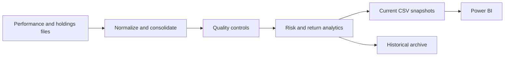

<div align="center">

# Fund Reporting ETL

**Turn heterogeneous fund data into auditable, Power BI-ready reporting datasets.**
Extraction &middot; normalization &middot; risk/return analytics &middot; historical backfills &middot; validation controls.

[](https://github.com/tiagoslantunes/fund-reporting-etl/actions/workflows/quality.yml)
[](https://www.python.org/)
[](https://pandas.pydata.org/)
[](#metrics)
[](LICENSE)

</div>

This project replaces manual consolidation of performance, volatility, exposure, and holdings files with a reproducible pipeline. It preserves missing-data evidence, enforces no look-ahead in historical metrics, and keeps immutable snapshots for auditability.

> [!NOTE]
> Source files are not included because they may be licensed or confidential. The repository
> contains the generic processing and validation logic only.

## Start here

Review [performance_analytics.py](performance_analytics.py) for the metric engine and
[tests/](tests) for checks that run without vendor files. The complete ETL requires
the input layout described below; a fresh clone does not include a runnable source dataset.

## Highlights

- Vendor-agnostic extraction of CSV/XLSX layouts with flexible date parsing.
- Absolute, benchmark-relative, and rolling risk/return metrics in one vectorized engine.
- Historical backfill that uses only data available at each month-end — no look-ahead.
- Header-drift and identity-change detection before numbers reach a report.
- Immutable snapshots kept alongside the current outputs for audit trails.

## Capabilities

| Stage | What it does |
|---|---|
| Extract | Reads heterogeneous CSV/XLSX vendor layouts and flexible dates |
| Transform | Normalizes identifiers, exposures, holdings, returns, and volatility |
| Analyse | Calculates absolute, benchmark, and relative performance metrics |
| Validate | Detects header drift, identity changes, and snapshot differences |
| Persist | Writes current outputs and immutable historical archives |



## Project structure

| Path | Purpose |
|---|---|
| [`automation_pipeline.py`](automation_pipeline.py) | Main ETL orchestration and current-period metrics |
| [`performance_analytics.py`](performance_analytics.py) | Vectorized absolute, benchmark, and relative analytics |
| [`backfill_performance_metrics.py`](backfill_performance_metrics.py) | Historical no-look-ahead rebuild |
| [`scripts/`](scripts) | Standalone validation utilities |
| [`tests/`](tests) | Deterministic helper tests that need no source data |

## Expected data layout

```text
<root>/
├── 01_MorningStar/
│   ├── 01_Daily/
│   ├── 02_Monthly/
│   └── Output/
└── Reporting Docs/
    └── Benchmark_Mapping.xlsx
```

The benchmark workbook must contain `Benchmark` and `Output Metric` sheets. Vendor-specific subfolders and filenames are documented in the parser configuration inside `automation_pipeline.py`.

## Quick start

```bash
git clone https://github.com/tiagoslantunes/fund-reporting-etl.git
cd fund-reporting-etl
python -m venv .venv
# macOS/Linux: source .venv/bin/activate
# PowerShell: .\.venv\Scripts\Activate.ps1
python -m pip install -r requirements.txt

python automation_pipeline.py --root /path/to/reporting-root
```

Alternatively, configure the root once:

```bash
export FUND_REPORTING_ROOT=/path/to/reporting-root
python automation_pipeline.py
```

PowerShell: `$env:FUND_REPORTING_ROOT = "C:\path\to\reporting-root"`.

## Historical backfill

Run the backfill after the main pipeline has produced `Performance.csv`:

```bash
python backfill_performance_metrics.py --root /path/to/reporting-root
```

For each month-end, the calculation uses only observations available up to that date. Past years are moved to `Output/All Perf Metrics Hist/`.

## Metrics

- Absolute: cumulative return, annualized volatility, Sharpe ratio, drawdown, downside deviation, and positive-month count.
- Benchmark: the same metrics for up to three configured benchmarks.
- Relative: excess return, tracking error, beta, rolling beta, hit rate, and correlation.
- Windows: configurable current, quarterly, yearly, multi-year, and since-inception periods.

## Validation

```bash
python scripts/validate_exposure_header_classification.py --root /path/to/reporting-root
python scripts/corr_threshold_validation.py
```

## Limitations

- Input layouts are vendor-specific and may require parser updates when exports change.
- The correlation rename heuristic is a control aid, not a substitute for authoritative security identifiers.
- Operational deployment still needs scheduling, access controls, monitoring, and governed data retention.
- Metrics are examples for analytics/reporting and do not constitute investment advice.

## Quality checks

Every push runs [`quality.yml`](.github/workflows/quality.yml) on GitHub Actions: dependency
install, a syntax check, CLI smoke tests, and the test suite — none of which need confidential
source files. To run the same checks locally:

```bash
python -m compileall -q .
python automation_pipeline.py --help
python backfill_performance_metrics.py --help
python scripts/validate_exposure_header_classification.py --help
python -m unittest discover -s tests -v
```

## Author

Tiago Antunes

## License

Released under the [MIT License](LICENSE).
